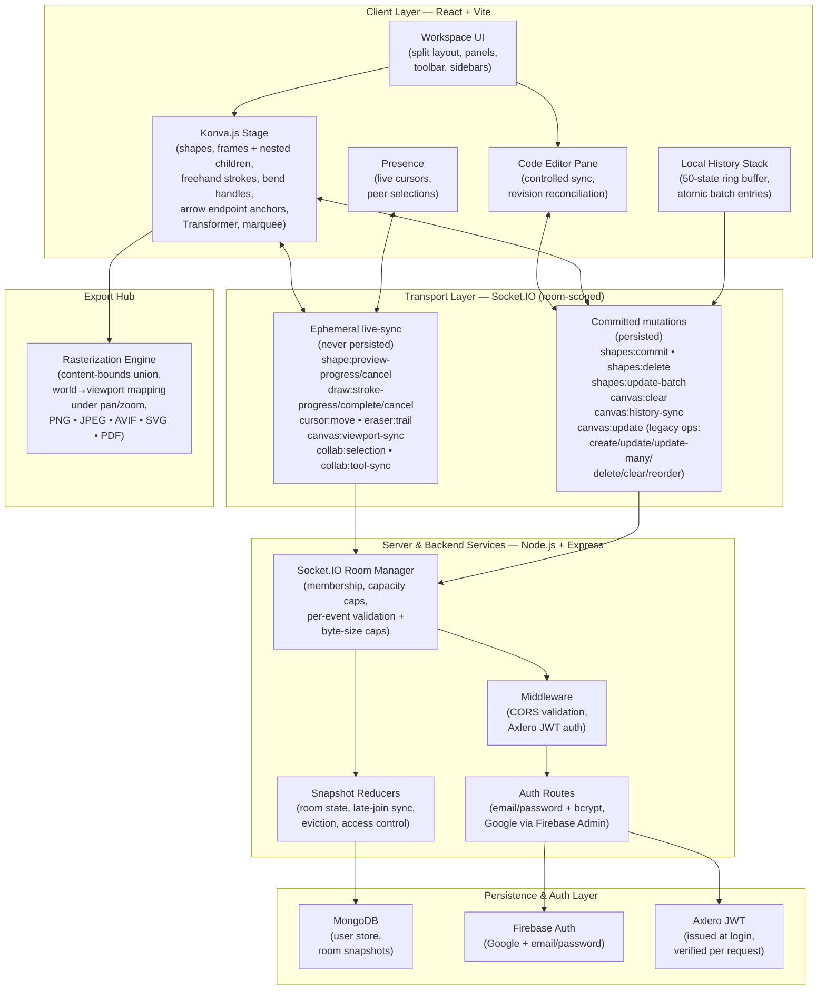

# Axlero SyncSpace (`Axlero_ps1`)

> High-performance real-time collaborative workspace featuring a shared infinite whiteboard (Konva.js), a synced code editor, and presence awareness — powered by Node.js, Socket.IO, and MongoDB/Firebase authentication.


---

## Table of Contents

- [Overview](#overview)
- [System Architecture](#system-architecture)
- [Core Features \& Modules](#core-features--modules)
- [Tech Stack](#tech-stack)
- [Local Setup \& Development](#local-setup--development)
- [Testing \& Verification](#testing--verification)
- [Project Structure](#project-structure)
- [Team Contributions \& Module Ownership](#team-contributions--module-ownership)

---

## Overview

Axlero SyncSpace is a multi-user room-based workspace. Each room pairs:

- an **infinite whiteboard** — rectangles, diamonds, ellipses, arrows (straight/curved/elbow), lines, freehand pen, text, images, and slide-container **frames**, rendered on a Konva.js stage with a violet Excalidraw-style treatment;
- a **code editor pane** — a controlled editor surface synchronized across clients with revision reconciliation and room isolation;
- **presence awareness** — live cursors, peer selection highlights, and a people panel, all transport-isolated per room.

Synchronization runs over **two Socket.IO pipelines**: an *ephemeral* stream (cursor moves, in-progress stroke/drag previews, viewport mirrors — never persisted, never in history) and a *committed* mutation channel (creates, updates, deletes, atomic batches, clears, history syncs — persisted to the room snapshot and recorded in undo/redo).

---

## System Architecture



**Data-flow summary:**

1. **Local gestures** mutate Konva nodes imperatively (60 fps, zero React state mid-drag); drop commits flow through one store entry point (`commitUpdate` / `commitUpdates`).
2. **Live peers** see throttled previews (creation drafts, drag transforms, frame blocks with translated members) on the ephemeral channel; these never enter history, exports, or persistence.
3. **Committed ops** apply locally (single history entry, including multi-shape batches), broadcast once, and converge on peers — the server validates, snapshots, and relays them room-wide.
4. **Late joiners** hydrate from the server room snapshot (`canvas:sync-init`); undo/redo restores broadcast full snapshots (`canvas:history-sync`).

---

## Core Features & Modules

### Collaborative Whiteboard (`src/components/canvas/`)
- **Shapes & frames** — rectangle, diamond, ellipse/circle, arrow (straight/curved/elbow with bend handles + draggable tip/tail endpoint anchors), line, freehand pen, text, images, and frames with native hierarchical Konva grouping (children ride the GPU transform with zero mid-drag React state).
- **Marquee / multi-selection** — drag-to-select rectangle, Shift+click toggling, shared Transformer, and rigid group drag that moves whole blocks in one atomic commit.
- **Snap-to-shape arrow connectors** — edge-midpoint/vertex/cardinal anchors with magnetic snap threshold, snap indicator ring, and stored `{ shapeId, anchor }` bindings so arrows follow moved shapes (live endpoint drags, single drops, group drops, and frame drops).
- **Rotation-aware anchors** — connection points stay valid under rotated nodes.
- **Smart guides & viewport sync** — alignment snap lines, zoom-to-pointer, pan streaming with receiver-side LERP smoothing.
- **Atomic frame drops with nested child tracking** — one history entry + one broadcast for frame + translated children + arrow maintenance; peers apply the block in a single pass and can never observe a half-moved frame (`update-many` op end to end).
- **Real-time live preview streaming** — throttled (~30 ms tick) creation/drag/frame-block previews with trailing-edge flush and cancel-on-drop convergence.

### Real-Time Code Collaboration (`src/components/editor/`, `src/hooks/`, `src/lib/yjsProvider.js`)
- Controlled editor synchronization with remote revision reconciliation.
- Room isolation via room-scoped state and per-room socket guards; Yjs room `Y.Doc` lifecycle ready for CRDT merge.

### Enterprise Security & Auth (`server/auth/`, `src/lib/auth.js`, `src/lib/firebaseAuth.js`)
- Axlero JWT issuance + per-request verification, Firebase Admin for Google and email/password flows, bcrypt password hashing, credential sanitization, and room capacity enforcement.

### Full-Bounds Export (`src/components/canvas/utils/exportHub.js`, `src/utils/exportUtils.js`)
- Content-bounds union across all elements (stroke widths, arrows, text included), padding margin, and **world→viewport mapping through live pan/zoom** so exports never clip — PNG, JPEG, AVIF, SVG (world-space viewBox), and dynamically-sized PDF, plus selection-only variants.

---

## Tech Stack

| Layer | Technology |
| :--- | :--- |
| Frontend | React 19, Vite 5, Tailwind CSS 3, Konva.js + react-konva |
| Backend | Node.js 22+, Express 5 |
| Real-Time Transport | Socket.IO 4 (unified + legacy op protocols) |
| Database | MongoDB 7 (users, room snapshots) |
| Auth | Firebase Auth + Firebase Admin, Axlero JWT (jsonwebtoken), bcryptjs |
| Collaboration Primitives | Yjs (room docs), pure reducer ops (`src/lib/collabOps.js`) |
| Testing & Tooling | `node:test` (no framework), Vite build (Rollup), PostCSS/Autoprefixer |

---

## Local Setup & Development

### Prerequisites

- **Node.js ≥ 22** and **npm**
- **MongoDB** connection string (Atlas) **or** Firebase credentials — see `.env.example`
- Two terminal windows (frontend + realtime server run separately in dev)

### Step-by-step

```bash
# 1. Clone the repository
git clone <repo-url> Axlero_ps1
cd Axlero_ps1

# 2. Install dependencies
npm install

# 3. Configure environment (never commit .env)
cp .env.example .env
# then edit .env:
#   VITE_SYNCSPACE_SERVER_URL=http://localhost:3000
#   MONGODB_URI=mongodb+srv://<user>:<password>@<cluster>/axlero
#   JWT_SECRET=<strong-random-secret>   # generate: node -e "console.log(require('crypto').randomBytes(32).toString('hex'))"
#   JWT_EXPIRES_IN=7d

# 4. Verify everything (unit + integration suites)
npm test

# 5. Run in development (terminal 1: frontend on :5173)
npm run dev

# 6. Run the realtime backend (terminal 2: server on :3000)
npm run dev:server

# 7. Production build (bake VITE_* vars BEFORE building)
npm run build
npm start   # serves the backend (point it at the dist/ frontend host)
```

| Script | What it does |
| :--- | :--- |
| `npm test` | `node --test test/*.test.cjs test/*.test.mjs` — full unit + integration suites |
| `npm run dev` | Vite dev server for the React frontend |
| `npm run dev:server` | Nodemon-style realtime backend (`server/index.cjs`) |
| `npm run build` | Production Vite bundle into `dist/` |
| `npm start` | Production backend server |

> **Multi-window collab check:** open the app in two browser windows side by side, join the same room, and drag a frame — Window 2 glides the whole block live and converges atomically on release.

---

## Testing & Verification

```bash
npm test
```

Suites cover (all pure, no network/DOM required):

| Area | Suites |
| :--- | :--- |
| Live-sync protocols | `live-sync.test.mjs` (preview payloads incl. frame-group members, validators, preview-map reducer, viewport LERP), `live-collab.test.cjs`, `stroke-stream.test.mjs`, `stroke-streaming.test.cjs` |
| Anchor math | `arrow-anchors.test.mjs` (edge/vertex/cardinal anchors, snap search, endpoint moves, bindings), `rotated-anchors.test.mjs`, `bound-arrow-follow.test.mjs`, `eraser-collision.test.mjs` |
| Frame drops & batches | `frame-drop.test.mjs` (membership, rigid translation, binding clears, arrow follows) |
| Export bounds | `export-bounds.test.mjs` (union + padding, pan/zoom crop mapping, selection bounds) |
| Room snapshots & ops | `room-snapshot.test.mjs`, `room-eviction.test.cjs`, `collab-ops.test.mjs` (incl. atomic `update-many`), `collab-reorder.test.cjs` |
| Auth & transport | `auth.test.cjs`, `google-auth.test.cjs`, `mongo-connection.test.cjs`, `socket.test.cjs`, `cors.test.cjs` |
| UI state & layout | `entry-state.test.mjs`, `split-layout.test.mjs`, `dashboard-rooms.test.mjs`, `canvas-hotkeys.test.mjs`, `yjs-provider.test.mjs` |

---

## Project Structure

```
Axlero_ps1/
├── src/
│   ├── App.jsx                      # Room composition: Workspace + collab hooks
│   ├── components/
│   │   ├── canvas/                  # Whiteboard: stage, renderer, toolbar,
│   │   │   │                        #   bend/endpoint handles, drawing + history hooks
│   │   │   ├── hooks/               #   useWhiteboardState (store), useCanvasHistory
│   │   │   └── utils/               #   shapes, snapping, liveSync, exportHub, …
│   │   ├── workspace/               # WhiteboardPanel / CodeEditorPanel shells
│   │   ├── editor/                  # Code editor integration point
│   │   ├── presence/ • room/ • auth/ • dashboard/ • layout/ • connection/
│   ├── hooks/                       # useCollaborativeWhiteboard (op shell), code collab
│   ├── lib/                         # collabOps (op validators/reducers), auth, room, socket, yjs
│   └── utils/                       # exportUtils (canonical raster export)
├── server/
│   ├── socket.cjs                   # Room manager: validation, snapshot reducers,
│   │                                #   eviction, access control, relay
│   ├── index.cjs • cors.cjs • auth/ • db/
├── test/                            # node:test suites (*.test.cjs / *.test.mjs)
└── .github/workflows/ci.yml         # CI automation
```

---

## Team Contributions & Module Ownership

| Contributor / Handle | Role | Core Modules & Contributions |
| :--- | :--- | :--- |
| `@sayon999-d` | Full-Stack / Canvas Core | Real-time live frame sync, marquee group selection, snap-to-shape arrow anchors, bounding-box multi-format export hub, and canvas gesture pipeline |
| `@jayeshjadhav5672-spec` | Team Lead / Architecture | Core repo architecture, CI/CD automation pipelines, code editor integration (`CodeEditor.jsx`, controlled sync), and upstream release management |
| `@arun` | Backend & Transport | Socket.IO room capacity management, presence engine, auth routes, and MongoDB persistence layers |
| `@kishan` *(editor owner, per in-code credits)* | Editor | Code editor integration surface (`CollabTextEditor.jsx`) |
| `@shree` *(Yjs owner, per in-code credits)* | CRDT / Presence Data | Yjs room `Y.Doc` lifecycle (`yjsProvider.js`), awareness plumbing |
| `@avantee` *(workspace UI owner, per in-code credits)* | Frontend UI | Workspace panels, split layout, dashboard and room shells |
| *[Your handle]* | *[Role]* | *[Describe your feature, files touched, and tests added]* |
